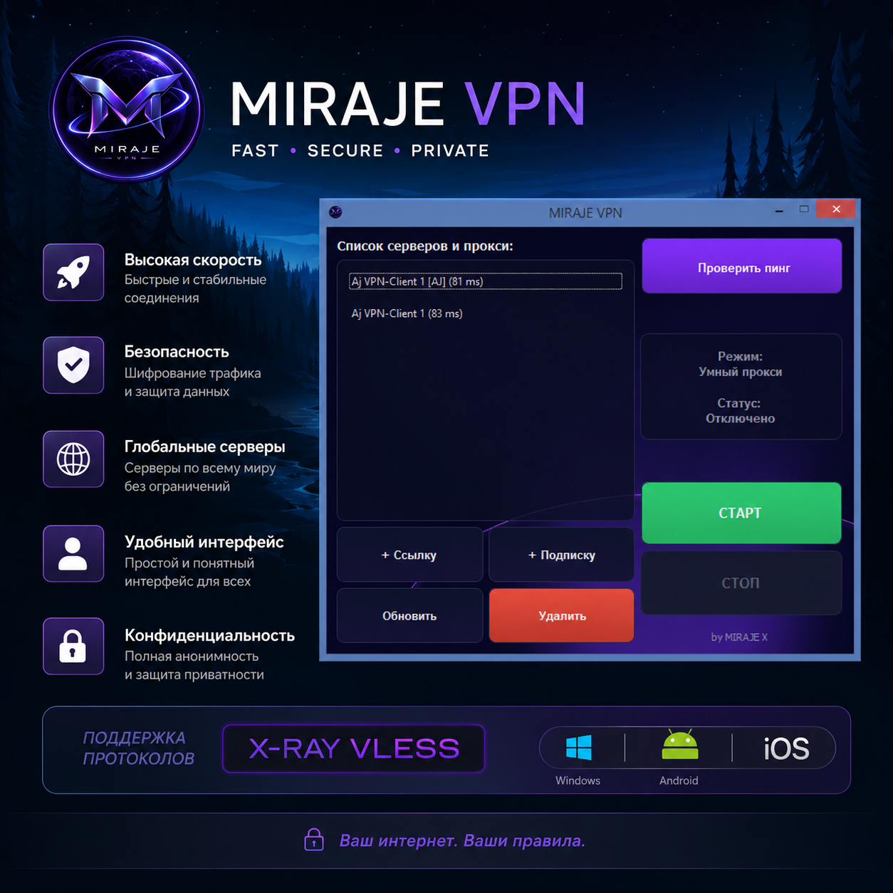

# MIRAJE VPN

**Современный VPN-клиент с умной маршрутизацией для Windows**

##  Описание

MIRAJE VPN — это легкий и быстрый VPN-клиент для Windows с поддержкой умной маршрутизации трафика. Приложение автоматически определяет российские ресурсы и направляет их напрямую, обеспечивая максимальную скорость для локальных сервисов и безопасное соединение для зарубежных.

##  Ключевые возможности

- **Умная маршрутизация** — российские сайты работают напрямую, зарубежные через VPN
- **Поддержка подписок** — автоматическое обновление списка серверов
- **Проверка пинга** — мгновенный замер скорости до серверов
- **Системный трей** — работа в фоновом режиме
- **Автообновление** — поддержка актуальности серверов
- **Лёгкий интерфейс** — минималистичный дизайн

##  Быстрый старт

1. Скачайте установщик или портативную версию
2. Запустите приложение
3. Добавьте сервер или подписку
4. Нажмите "СТАРТ"

##  Варианты установки

### Установщик
- **MIRAJE_VPN_Setup_32_64_bit.exe** — для 32-64 битных систем
- Автоматическая установка со всеми компонентами
- Создание ярлыков на рабочем столе

### Портативная версия
- **Portable_32-64_bit.rar** — для 32-64 битных систем
- Не требует установки
- Можно запускать с USB-накопителя

##  Системные требования

| Компонент | Минимальные | Рекомендуемые |
|-----------|-------------|---------------|
| **ОС** | Windows 7 SP1 | Windows 10/11 |
| **Архитектура** | 32-bit или 64-bit | 64-bit |
| **RAM** | 512 MB | 2 GB+ |
| **Место на диске** | 100 MB | 200 MB |
| **Права** | Администратор | Администратор |

##  Поддерживаемые протоколы

- VLESS с REALITY
- WebSocket транспорт
- gRPC транспорт
- TCP транспорт

##  Поддерживаемые форматы

- VLESS ссылки
- Подписки (base64 и plain)

##  Особенности работы

### Умная маршрутизация
Приложение автоматически определяет:
- Российские домены (.ru, .su, .рф) → напрямую
- Зарубежные ресурсы → через VPN
- Локальные адреса → напрямую

### Системный прокси
- SOCKS5 на порту 10808
- HTTP на порту 10809
- Автоматическая настройка Windows

##  Загрузка

### Текущая версия: 1.0.1

| Версия | Windows 7+ | Размер |
|--------|------------|--------|
| Установщик 32-64 bit | [Скачать](https://github.com/thetemirbolatov/MirajeVPN_Client_Xray/releases/download/v1.0.1/MIRAJE_VPN_Setup_32-64_bit.exe) | ~15 MB |
| Установщик win 7 32-64 bit | [Скачать](https://github.com/thetemirbolatov/MirajeVPN_Client_Xray/releases/download/v1.0.1/MIRAJE_VPN_Setup_win7_32-64_bit.exe) | ~15 MB |
| Портативная 32-64 bit | [Скачать](https://github.com/thetemirbolatov/MirajeVPN_Client_Xray/releases/download/v1.0.1/portable_32-64_bit.rar) | ~12 MB |
| Портативная win 7 32-64 bit | [Скачать](https://github.com/thetemirbolatov/MirajeVPN_Client_Xray/releases/download/v1.0.1/portable_win7_32-64_bit.rar) | ~12 MB |

##  Установка

### Установщик
1. Запустите установщик
2. Выберите язык
3. Следуйте инструкциям
4. Готово!

### Портативная версия
1. Распакуйте архив
2. Запустите MIRAJE VPN.exe
3. Используйте

## ❓ FAQ

**В: Нужны ли права администратора?**
О: Да, для настройки системного прокси.

**В: Работает ли на Windows 7?**
О: Да, поддерживается Windows 7 SP1 и выше.

**В: Как добавить сервер?**
О: Через кнопку "+ Ссылку" или "+ Подписку".

**В: Почему российские сайты работают напрямую?**
О: Это умная маршрутизация для оптимальной скорости.

##  Безопасность

- Шифрование трафика
- Защита от DNS-утечек
- Автоматическое отключение при закрытии
- Без логов активности

##  Автор

**thetemirbolatov**

- Telegram: [@thetemirbolatov](https://t.me/thetemirbolatov)
- GitHub: [github.com/thetemirbolatov](https://github.com/thetemirbolatov)

##  Лицензия

Проприетарное программное обеспечение. Все права защищены.

Copyright © 2026 MIRAJE X

##  Благодарности

Спасибо всем, кто помогает развивать проект!

---

**MIRAJE VPN** — Ваш безопасный доступ к глобальной сети! 
